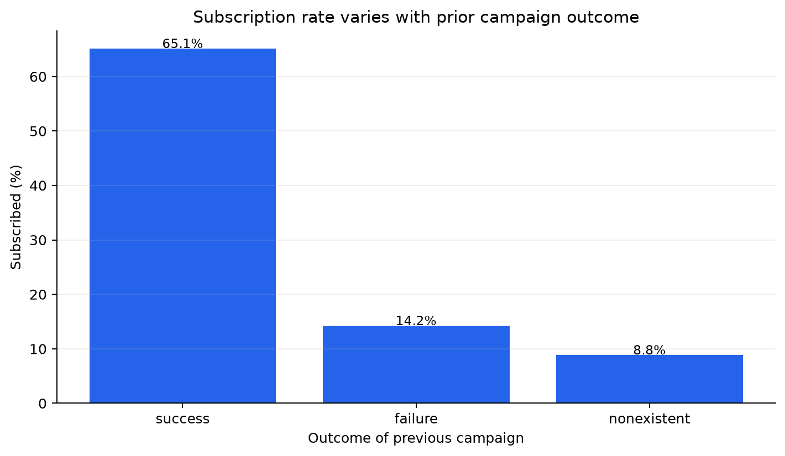
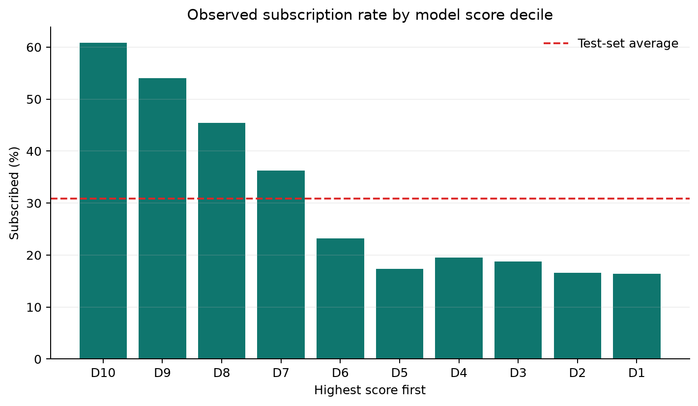

# Campaign Compass: Find the Next Best Customer

A portfolio project for deciding **who to contact, when to contact them, and how to measure a campaign**—using Portugal bank direct-marketing data.

> **Decision in one sentence:** use historical conversion rates and a pre-contact propensity ranking to focus a limited outreach budget, then validate the lift with a randomized holdout before scaling.





## Why this project matters

A bank cannot call everyone equally often. This analysis turns 41,188 historical outreach records into an actionable targeting workflow, while avoiding the common trap of training on information only known after a call has happened. It combines SQL exploration, a reproducible Python pipeline, an interpretable model benchmark, and a stakeholder-ready decision memo.

## Questions answered

1. How does subscription rate vary by contact history and customer segment?
2. Where should the next campaign test its limited calling capacity?
3. Can a model rank customers using only information available before the next call?
4. What experiment would prove that model-guided outreach creates incremental value?

## Key result

The 41,188-record dataset has an **11.3%** overall subscription rate. On the chronological 20% holdout, the logistic-regression baseline reaches **0.701 ROC-AUC** and **0.505 average precision**; its highest-scored decile converts at **60.9%** (1.97× the holdout average).

The holdout response rate is **30.8%**, far above the earlier training period’s **6.4%**. That shift is a central finding: the score ranking is a historical stress test, and its lift should not be expected to transfer to a current campaign without fresh validation. Metrics describe associations; they do **not** establish causal lift or profitability.

## Quick start

Requires Python 3.10 or newer.

```bash
python -m venv .venv
# Windows: .venv\Scripts\activate
# macOS/Linux: source .venv/bin/activate
pip install -r requirements.txt
python -m src.analyze
```

The script downloads the public UCI archive into `data/` on first run, then writes:

- `reports/analysis_summary.md` — concise business readout and model evaluation
- `reports/segment_rates.csv` — conversion rates and sample sizes by segment
- `reports/model_metrics.json` — holdout metrics and top-decile lift
- `images/conversion_by_previous_outcome.png` — presentation-ready chart
- `images/decile_lift.png` — ranked targeting diagnostic

Raw data is not tracked by Git. Run again with `--offline` after the first download to use the cached CSV.

Run the SQL examples in `sql/exploration.sql` with DuckDB. They cover baseline conversion, prior outcome, customer segments, contact pressure, and month/channel mix.

## Project map

```text
├── data/                 # Local-only downloaded data (gitignored)
├── images/               # Generated charts
├── reports/              # Generated analysis outputs
├── sql/                  # Portable exploration queries
├── src/analyze.py        # Data download, analysis, model, outputs
├── requirements.txt
└── README.md
```

## Method

- **Source:** UCI Machine Learning Repository, *Bank Marketing* (`bank-additional-full.csv`), 41,188 rows and 20 input features. The records are ordered by date and cover May 2008–November 2010. See [UCI dataset page](https://archive.ics.uci.edu/dataset/222/bank+marketing) and [citation](CITATION.cff). The dataset is CC BY 4.0.
- **Target:** whether the client subscribed to a term deposit (`y`).
- **Leakage control:** `duration` (call length) is deliberately excluded because it is only known after contact and is strongly tied to the outcome. The feature set also excludes `campaign`, a count that can change as the current campaign progresses. These choices make the ranking inputs appropriate for pre-call prioritization.
- **Validation:** chronological 80/20 split: train on the earlier rows and reserve the latest rows as an out-of-time holdout. Numeric features are median-imputed and scaled; categorical features are most-frequent-imputed and one-hot encoded. A class-weighted logistic regression provides a transparent baseline.
- **Ranking diagnostic:** compare observed subscription rate in the highest-scored decile with the test-set average. This is not a treatment effect: the historical targeting policy was not randomized.

## What a real team should do next

1. Confirm the contact-cost, capacity, and value of a successful subscription with campaign owners.
2. Randomly assign eligible customers to model-ranked outreach and business-as-usual holdout groups.
3. Pre-register primary metrics (incremental subscriptions per 1,000 eligible customers and net value per contact), guardrails, and sample size.
4. Run the pilot, check calibration and subgroup performance, then decide whether to expand.

Do not operationalize the model without privacy, fairness, compliance, and contact-frequency review. Historical patterns are not permission to contact a person.

## Reproducibility notes

The model uses a fixed random seed (`42`). Scikit-learn's encoder compatibility is handled across recent versions. Results may vary slightly across dependency versions. No personally identifying information is included in this repository; the dataset is public and is downloaded locally at runtime.

## Skills demonstrated

Python · pandas · SQL · scikit-learn · data quality checks · leakage-aware feature design · classification metrics · segmentation · visualization · experiment design · executive communication


## Dataset attribution

Data provided under [CC BY 4.0](https://creativecommons.org/licenses/by/4.0/). Please credit Moro, Rita, and Cortez (2014), [Bank Marketing](https://doi.org/10.24432/C5K306), UCI Machine Learning Repository.


